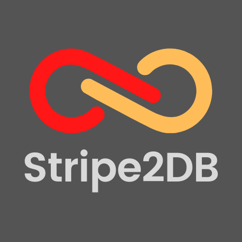
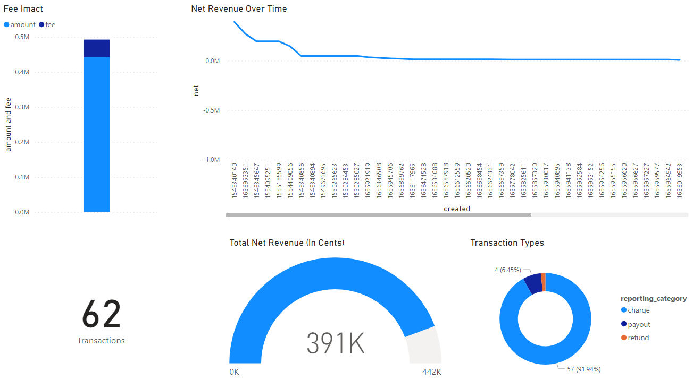

<!-- PROJECT LOGO -->
<br />
<div align="center">
  <a href="https://github.com/yourguyphil/Stripe2DB/blob/master/README.md">
    
  </a>

  <h3 align="center">Stripe2DB</h3>
  <p align="center">
    Stripe API Data Export Tool that loads transaction information into MS SQL so that dynamic reports can be created using Power Bi.
    <br />
    <br />
    <a href="https://github.com/yourguyphil/Stripe2DB/blob/master/README.md"><strong>Explore the docs »</strong></a>
  </p>
</div>

<!-- TABLE OF CONTENTS -->
<details>
  <summary>Table of Contents</summary>
  <ol>
    <li>
      <a href="#about-the-project">About The Project</a>
      <ul>
        <li><a href="#built-with">Built With</a></li>
      </ul>
    </li>
    <li>
      <a href="#getting-started">Getting Started</a>
      <ul>
        <li><a href="#prerequisites">Prerequisites</a></li>
        <li><a href="#installation">Installation</a></li>
      </ul>
    </li>
    <li><a href="#usage">Usage</a></li>
    <li><a href="#roadmap">Roadmap</a></li>
    <li><a href="#contributing">Contributing</a></li>
    <li><a href="#license">License</a></li>
    <li><a href="#contact">Contact</a></li>
    <li><a href="#acknowledgments">Acknowledgments</a></li>
  </ol>
</details>

<!-- ABOUT THE PROJECT -->
## About The Project

Java Spring Boot Scheduled Web Application that leverages the following Stripe APIs:

* [List all balance transactions](https://stripe.com/docs/api/balance_transactions/list)

To export data into a MS SQL instance, so that dynamic dashboards can be created using Power Bi / Tableau. 

### Built With

* [Java 17](https://openjdk.org/projects/jdk/17/)
* [Spring Boot](https://spring.io/projects/spring-boot)
* [MS SQL](https://www.microsoft.com/en-us/sql-server/sql-server-2019)
* [Power Bi](https://powerbi.microsoft.com/en-us/)

<p align="right">(<a href="#top">back to top</a>)</p>

<!-- GETTING STARTED -->
## Getting Started

### Prerequisites

* Configure Stripe Authentication in application.yml (https://stripe.com/docs/api/authentication)
  ```sh
  stripe:
    apikey: 'INSERT STRIP API KEY HERE'
  ```
  
* Configure MS SQL Connection String (https://www.connectionstrings.com/microsoft-data-sqlclient/standard-security/)
  ```sh
  sql: 
    connection: 'INSERT SQL CONNECTION STRING HERE'
  ```

### Installation

_Below is an example of how you can instruct your audience on installing and setting up your app. This template doesn't rely on any external dependencies or services._

1. Get a Stripe API Key at [Stripe API](https://stripe.com/docs/api), and configure a MS SQL DB
2. Clone the repo
   ```sh
   https://github.com/yourguyphil/Stripe2DB.git
   ```
3. Flesh out application.yml per the Prerequisites above
4. Refresh Gradle
5. BootRun Targeting Stripe2dbApplication

<p align="right">(<a href="#top">back to top</a>)</p>


<!-- USAGE EXAMPLES -->
## Usage

Docker image building example (From directory of Dockerfile)

  ```sh
  docker build -t stripe2db:1.0 .
  ```

Power Bi Sample Dash

<a href="https://github.com/yourguyphil/Stripe2DB/blob/master/README.md">
  
</a>

See the [open issues](https://github.com/yourguyphil/Stripe2DB/issues) for a full list of proposed features (and known issues).

<p align="right">(<a href="#top">back to top</a>)</p>

<!-- CONTRIBUTING -->
## Contributing

Contributions are what make the open source community such an amazing place to learn, inspire, and create. Any contributions you make are **greatly appreciated**.

If you have a suggestion that would make this better, please fork the repo and create a pull request. You can also simply open an issue with the tag "enhancement".
Don't forget to give the project a star! Thanks again!

1. Fork the Project
2. Create your Feature Branch (`git checkout -b feature/AmazingFeature`)
3. Commit your Changes (`git commit -m 'Add some AmazingFeature'`)
4. Push to the Branch (`git push origin feature/AmazingFeature`)
5. Open a Pull Request

<p align="right">(<a href="#top">back to top</a>)</p>

<!-- LICENSE -->
## License

Distributed under the MIT License. See `LICENSE.txt` for more information.

<p align="right">(<a href="#top">back to top</a>)</p>


<!-- CONTACT -->
## Contact

Philips Nguyen - [@yourguyphil](https://github.com/yourguyphil)

<p align="right">(<a href="#top">back to top</a>)</p>

<!-- ACKNOWLEDGMENTS -->
## Acknowledgments

Shout out to these awesome projects

* [Best README Template](https://github.com/othneildrew/Best-README-Template/)
* [Spring Initializr](https://start.spring.io/)
* [Stripe API](https://stripe.com/docs/api)
* [Choose an Open Source License](https://choosealicense.com)
* [GitHub Emoji Cheat Sheet](https://www.webpagefx.com/tools/emoji-cheat-sheet)

<p align="right">(<a href="#top">back to top</a>)</p>
